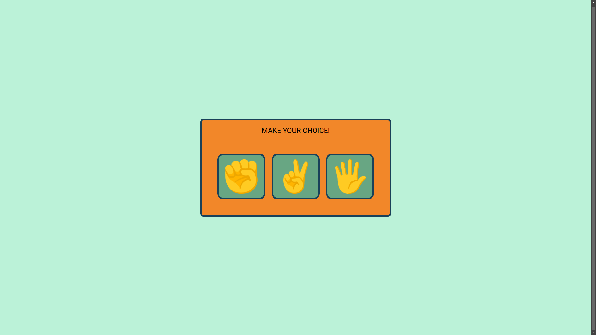

# Rock, Paper, Scissors Game



A simple yet entertaining web-based implementation of the classic Rock, Paper, Scissors game. Have fun challenging the computer and see who comes out on top!

## Table of Contents

- [Description](#description)
- [Features](#features)
- [Technologies Used](#technologies-used)
- [Usage](#usage)
- [Demo](#demo)
- [Screenshots](#screenshots)
- [Contributions](#contributions)
- [License](#license)

## Description

The Rock, Paper, Scissors Game project is designed to provide a fun and interactive way to play the popular hand game against an AI opponent. This project offers a straightforward user interface, immediate feedback on game outcomes, and a scoring system to keep track of your wins, losses, and ties.

## Features

- **User vs. Computer:** Play Rock, Paper, Scissors against an AI-controlled opponent.
- **Real-time Feedback:** Receive instant feedback on the winner of each round.
- **Score Keeping:** Keep track of your overall performance with a score counter.
- **User-Friendly Interface:** A simple and intuitive user interface for an enjoyable gaming experience.

## Technologies Used

This project leverages the following technologies:

- **HTML:** The backbone of the web interface.
- **CSS:** Styles and layouts to make the game visually appealing.
- **JavaScript:** The game logic is implemented in JavaScript to enable user-computer interactions.

## Usage

1. **Github Pages**

   Simply go to the deployments tab of this repository and checkout the game online!

1. **Clone the repository**

   Clone this repository to your local machine using the following command:
   ```bash
   git clone https://github.com/your-username/rock-paper-scissors.git
    ```
    **Open the Game:**

    Navigate to the project directory and open the index.html file in your preferred web browser.

    **Play the Game:**

    Click on one of the available options: Rock, Paper, or Scissors.
    Observe the immediate outcome of the round.
    The game will keep track of the overall score.

## Demo

You can try out the game live by visiting the following link: [Rock, Paper, Scissors Game](https://suvansarkar.github.io/RPS-game/)

## Contributions
Contributions are greatly appreciated! If you have ideas for improvements, additional features, or bug fixes, please feel free to contribute to this project. Here's how:

1. Fork the repository.
2. Create a new branch for your changes.
3. Commit your changes and create a descriptive pull request.
4. Your contributions will be reviewed, and if they align with the project's goals, they will be merged.

## License
This project is open-source and available under the MIT License. Feel free to use, modify, and distribute the code as per the terms of the license.

Enjoy playing Rock, Paper, Scissors, and have fun coding!


